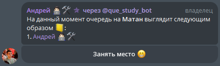

# QueBot
A bot that will help you or your company organize queues in telegram chat with a single button.

## Project setup ⚙️
The setup instructions use task commands. You need to install Taskfile or refer to the commands in the Taskfile.yml and manually enter them 😈.

To get all available task commands with description use `task`.

This project uses tools:
- go-n-i18n: [MrNemo64/go-n-i18n](https://github.com/MrNemo64/go-n-i18n)

### Run steps 🚀
1. Install all tools and deps: `go mod download`
2. Ways to configure app:
   - **automatic configuration**. Use `task set-example` for default configuration.\
   - **manually configuration**. Use example configs or env to navigate through the settings.
You should use `task set-example` to auto create config files with options and change it for use.

    Don't forget to set **bot.token** that you can get in __[@BotFather](https://t.me/BotFather)__.
   
    For configuration in container use config with mounting and envs.
    **All app parameters are both accessible with envs and config file(configs  config.toml)**. 

    To get help configuration info use `task help`.

### Examples 🤖
1. Query to create queue **Матан**:

    

2. Message with new queue button:

    

3. Message with commit queue button:

    

